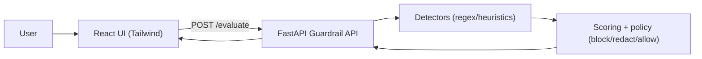

# AI Safety Guardrail System (FastAPI + React + Tailwind CSS)

A lightweight, deterministic, and explainable **AI Safety Guardrail System** designed to evaluate user prompts and LLM-generated outputs in real time. It detects and mitigates prompt injections, jailbreaks, PII exposure, and hallucination risks before they reach the user.

---

## 1. System Architecture

Below is the conceptual architecture of the guardrail service and how requests are processed:



For a detailed design of our workflows, tech stack, and safety index models, see the [Architecture Directory](file:///d:/Aiden/architecture.md).

---

## 2. Core Features

### 💻 Premium Control Dashboard UI
* **Real-time Overview Panel**: Displays core stats (Total Request Count, Blocked Rate, Redaction Rate, and Average Risk Score) alongside an interactive safety index health bar.
* **Live Appraisals Feed**: Pre-populated with historical records and dynamically prepends new evaluations in real time, updating the dashboard analytics instantly.
* **Interactive Playground**: Features side-by-side prompt and model response inputs, visual risk gauges (donut progress charts), engine safety checklists, and output sandboxes.
* **Scenario Presets**: Instantly simulate **Prompt Injection**, **PII Leak**, **Hallucination Risk**, and **Safe Response** payloads with a single click.

### 🛡️ Guardrail Rules & Engines
* **Prompt Injection / Jailbreak Bypass**: Checks incoming prompts against override signatures, instructions leakage, and impersonation attempts (severity scores from `0.6` to `0.94`).
* **PII Redactor / Masker**: Automatically scans and masks sensitive data patterns (Emails, US SSNs, Phone numbers, and Payment cards) returning a safe redacted string.
* **Hallucination Estimator**: Estimates factual consistency risks by analyzing number/year densities, high-confidence assertions (`guarantee`, `definitely`), and action verbs.
* **Strict Verdict Precedence**: Ensures that block rules (prompt attacks, high hallucination scores &ge; 0.7, or other safety threats) take absolute precedence over redaction and allow states.

### 🌐 OpenRouter LLM Integration
* If the `model_response` parameter is omitted or cleared in the playground, and an API key is configured, the backend automatically calls the OpenRouter API.
* It routes the query to free-tier LLMs via `"openrouter/free"`, evaluates the generated output through the guardrail engines, and delivers the safe output to the dashboard.

---

## 3. How to Run

### A. Backend (FastAPI)
1. **Navigate to the Backend Directory**:
   ```bash
   cd Backend
   ```
2. **Setup virtual environment and install dependencies**:
   ```bash
   python -m venv venv
   venv\Scripts\python -m pip install -r requirements.txt
   ```
3. **Configure Environment Variables**:
   Create a `.env` file inside the `Backend` directory:
   ```env
   CORS_ORIGINS=http://127.0.0.1:5173,http://localhost:5173
   OPENROUTER_API_KEY=your_openrouter_api_key_here
   OPENROUTER_MODEL=openrouter/free
   ```
4. **Start the API Server**:
   ```bash
   venv\Scripts\python -m uvicorn main:app --reload --port 8000
   ```
   - Health check: `GET http://127.0.0.1:8000/healthz`
   - Evaluate endpoint: `POST http://127.0.0.1:8000/evaluate`
   - API Docs: `GET http://127.0.0.1:8000/docs`

### B. Frontend (React + Vite)
1. **Navigate to the Frontend Directory**:
   ```bash
   cd Frontend
   ```
2. **Start the local development server**:
   ```bash
   npm run dev -- --host 127.0.0.1 --port 5173
   ```
3. **Open the Dashboard**:
   Go to **[http://127.0.0.1:5173](http://127.0.0.1:5173)** in your browser.
