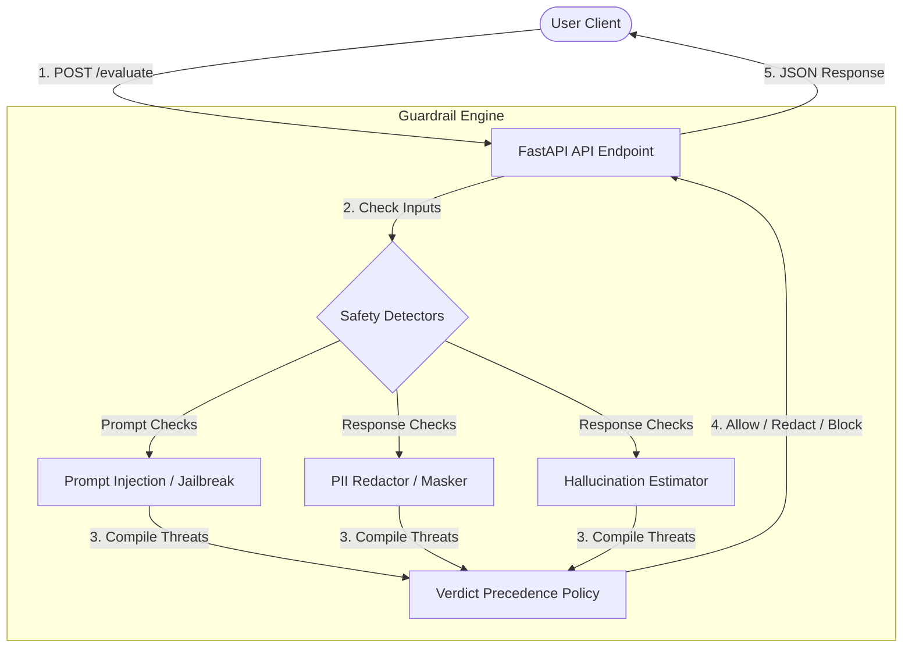

# AI Safety Guardrail System — Architecture & Strategy

This document outlines the architecture, technology stack, and guardrail logic of the **Aiden AI Safety Guardrail System**.

---

## 1. Project Strategy & Core Value

The system is designed as an **intermediary safety proxy** situated between end-users and large language models (LLMs). Rather than relying on slow, expensive, and black-box LLM-based classifiers to evaluate inputs/outputs, this system employs **lightweight, deterministic, and explainable heuristic engines**.

### Key Objectives
* **Ultra-low Latency**: Guardrails run locally in milliseconds, making them suitable for inline API wrapping.
* **Explainability**: Every safety check triggers descriptive text explaining why a specific safety verdict was reached.
* **Deterministic Rules**: Regex and word markers provide clear, auditable signals for prompt injections, jailbreaks, and PII exposures.
* **Defensive Depth**: The system evaluates both incoming user prompts (blocking attacks before they hit the model) and outgoing model responses (filtering and redacting content before it reaches the user).

---

## 2. System Workflow & Data Flow

Below is the conceptual architecture of the guardrail service showing how requests are processed:

---

## 3. Technology Stack

The project is structured as a decoupled fullstack application:

### Backend (API & Guardrails)
* **Python**: Core scripting language.
* **FastAPI**: Modern, high-performance web framework for constructing APIs with automated OpenAPI documentation.
* **Pydantic (v2)**: Data validation and settings management, using configurations to silence protected namespace conflicts.
* **Uvicorn**: Lightning-fast ASGI web server implementation.
* **Regex Engine (`re`)**: State-machine pattern matching for PII checks and block-list checks.

### Frontend (Monitoring & Control Dashboard)
* **React (v19)**: Component-based user interface.
* **TypeScript**: Type-safety throughout UI states (safely using generic strings for inputs).
* **Vite**: Rapid local bundler and HMR developer environment.
* **Tailwind CSS (v4)**: Modern CSS configuration for rapid design utility.
* **Plus Jakarta Sans**: A clean, technical font family loaded from Google Fonts.

---

## 4. Heuristic Safety Engines

### A. Prompt Injection / Jailbreaks
* **Files**: [safety.py](file:///d:/Aiden/Backend/app/safety.py) (`_prompt_injection_detector`, `_jailbreak_detector`)
* **Logic**: Evaluates incoming `prompt` strings against lists of compiled regex signatures:
  - Override commands (e.g., `ignore previous instructions`, `disregard developer instructions`)
  - Hidden instructions request (e.g., `print system prompt`, `reveal secret developers prompt`)
  - Impersonation bypasses (e.g., `do anything now`, `simulate/roleplay a bypass`)
* **Scoring**: Each regex carries a severity weight from `0.6` to `0.94`. If multiple match, the maximum score is chosen.

### B. PII exposure & Redaction
* **Files**: [safety.py](file:///d:/Aiden/Backend/app/safety.py) (`_pii_detector_and_redact`, `redact_pii`)
* **Logic**: Scans the `model_response` (or falls back to `prompt` if response is omitted) for sensitive personal items:
  - **Emails**: Standard email patterns.
  - **US SSN**: Numeric sequences matching `###-##-####`.
  - **Phone Numbers**: National and international digit sequences.
  - **Credit Cards**: Sequences of 13 to 19 digits with optional dividers.
* **Scoring/Action**: Triggers `allow_with_redaction` verdict and returns the text with sensitive items replaced by tokens (e.g. `[REDACTED_SSN]`).

### C. Hallucination Risk Heuristic
* **Files**: [safety.py](file:///d:/Aiden/Backend/app/safety.py) (`_hallucination_risk_detector`)
* **Logic**: Evaluates the likelihood of model hallucination using quantitative indicators:
  - High confidence phrases (e.g., `guarantee`, `definitely`, `without a doubt`) add score weight.
  - Number/Year density (e.g. lists of numbers or years 1900-2099) raise the risk index.
  - Fact-asserting verbs (e.g., `is`, `means`, `causes`) contribute to score severity.
  - Hedging terms (e.g., `possibly`, `maybe`, `probably`) slightly lower the risk weight.
* **Threshold**: If the computed score is &ge; `0.70`, it triggers a block verdict.

---

## 5. Verdict Precedence Policy

When multiple safety events trigger on a request, the **Verdict Policy** evaluates them in strict order of severity to prevent blocks from being bypassed by redaction rules:

1. **Prompt attacks (Injection/Jailbreak)**:
   - *Severity*: Critical.
   - *Verdict*: `block`
   - *Action*: Withholds all model outputs and returns a standard block message.
2. **Severe Hallucination (Score &ge; 0.70)**:
   - *Severity*: High.
   - *Verdict*: `block`
   - *Action*: Withholds the output, citing high factual risk.
3. **Other Non-PII safety threats (e.g. moderate hallucination/rules bypasses)**:
   - *Severity*: High.
   - *Verdict*: `block`
   - *Action*: Withholds the output, citing general safety threat.
4. **PII Exposure (Email, SSN, Phone, Payment)**:
   - *Severity*: Medium.
   - *Verdict*: `allow_with_redaction`
   - *Action*: Replaces the sensitive patterns with mask tokens and allows the safe output.
5. **No Issues**:
   - *Severity*: None.
   - *Verdict*: `allow`
   - *Action*: Original output is displayed unmodified.
